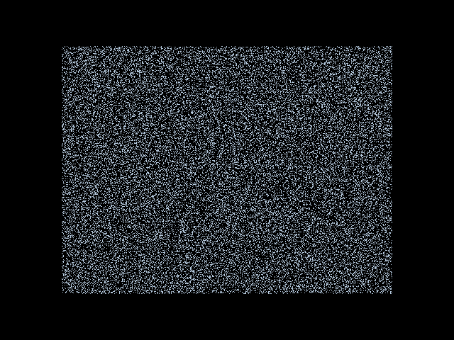

# galax

A 2D gravitational N-body simulation using the Fast Multipole Method,
accelerated by GPU compute (WebGPU / wgpu).


<p align="center">
  
</p>

## Overview

galax simulates the gravitational interaction of up to hundreds of thousands
of Bodies in 2D using the Fast Multipole Method. The core algorithm runs on
the GPU via wgpu (Metal, Vulkan, DX12) — and in the browser via WebGPU.

### What makes it fast

- **O(N) FMM** — the Fast Multipole Method replaces the O(N²) all-pairs
  summation with a tree-based approximation that scales linearly with
  the number of bodies
- **GPU compute** — the entire 6-pass FMM pipeline runs as WGSL compute
  shaders, not just a single reduction
- **Adaptive quadtree** — Morton-curve sorted, 2:1 balanced, built in O(N log N)
- **Cartesian Taylor expansions** — the 2D `1/r` gravitational kernel is
  expanded using Cartesian tensors (not complex Laurent series)

## Requirements

- **Rust toolchain** (stable; `cargo`, `rustc`). Built and tested on macOS;
  works on Linux and Windows.
- **GPU path (`--gpu`)** — any GPU with a wgpu backend: Metal (Apple Silicon),
  Vulkan (Linux/Windows), DX12 (Windows). On Apple Silicon the CPU and GPU
  share unified memory, which makes the GPU path especially efficient.
- **Browser build** — a WebGPU-capable browser: Chrome/Edge 113+, or Firefox
  Nightly. See [Browser demo](#browser-demo-galax-wasm) for caveats.

## Quick start

### 1. Run a simulation (CLI)

```bash
# 100k bodies, Plummer sphere, 200 steps, GPU
cargo run -p galax-cli --release -- --n 100000 --init plummer --gpu --steps 200 --progress
```

The CLI prints energy/momentum diagnostics every `--energy-every` steps.
Omit `--gpu` to use the CPU (Rayon-parallel) FMM backend instead.

### 2. Visualise

```bash
# Interactive GPU-accelerated visualisation
cargo run -p galax-viz --release -- --n 10000 --init disk --gpu
```

Controls: scroll to zoom, left-drag to pan, Escape to exit.
For fewer than ~5,000–20,000 bodies the visualiser automatically uses the
exact O(N²) method (FMM is only a win at scale); override with `--fmm` / `--n2`.

### 3. Run in the browser

```bash
cd galax-wasm
./deploy.sh
npx serve pkg/
# or deploy instantly:
npx surge pkg/ galax-nbody.surge.sh
```

Requires a WebGPU-capable browser (Chrome 113+, Edge 113+, Firefox Nightly).
See [Browser demo](#browser-demo-galax-wasm) for how this compares to native.

## Initial conditions (`--init`)

galax ships four built-in starting configurations, selected with
`--init <name>` on both `galax-cli` and `galax-viz` (default: `uniform`):

| Name | Description |
|------|-------------|
| `uniform` | Bodies uniformly distributed in a 100 × 100 square with random masses. The most basic stress test. |
| `plummer` | A Plummer sphere: a self-gravitating, centrally-concentrated equilibrium model (the standard testbed for collisionless N-body codes). Radii are sampled from the Plummer density profile and velocities from the isotropic equilibrium distribution. |
| `disk` | An exponential disk galaxy. Bodies orbit on circular orbits with a small (~5%) velocity dispersion, giving a rotating disk structure. |
| `galaxy` | A supermassive central body (mass 1000) plus test particles on circular orbits with a 1/r surface-density profile. The classic "SMBH + stars" toy model. |

These presets are also available as body-count and preset selectors in the
browser demo, so you can try each without the CLI.

## Command-line reference (`galax-cli`)

```
cargo run -p galax-cli --release -- [OPTIONS]
```

| Flag | Type / default | Description |
|------|----------------|-------------|
| `--n <N>` | usize, required unless `--load` | Number of bodies to simulate. |
| `--steps <N>` | u64 | Number of timesteps to run. Defaults to 10 (or `ceil(t_end/dt)` if `--t-end` is given). |
| `--t-end <T>` | f64 | Stop when simulation time reaches T; overrides `--steps`. |
| `--dt <dt>` | f64 | Timestep cap. Default is an internal stability bound: `0.5 / sqrt(max|a|)`. |
| `--softening <ε>` | f64 | Plummer softening length. Default is derived from the data: `0.1 ×` mean nearest-neighbour distance over the first 1000 bodies. |
| `--init <name>` | string, default `uniform` | Initial conditions preset: `uniform`, `plummer`, `disk`, or `galaxy`. |
| `--n-max <N>` | usize, default `32` | Maximum bodies per leaf in the quadtree. Smaller = deeper tree, more accurate near field, slower. |
| `--p <P>` | usize, default `4` | FMM multipole expansion order. Higher = more accurate, ~4× slower per pass. See [Method](#method). |
| `--gpu` | flag | Use the GPU (WGSL compute) FMM backend instead of CPU. |
| `--gpu-crosscheck` | flag | Run both GPU and CPU FMM on the same bodies and report per-body relative force error. Development/correctness aid. |
| `--validate` | flag | After the run, cross-check the FMM forces against a sampled exact N² calculation and print error stats. |
| `--validate-samples <N>` | usize, default `1000` | Number of bodies sampled for `--validate`. |
| `--n2-regression` | flag | Full (unsampled) N² regression check. Only valid for N ≤ 2000. |
| `--convergence` | flag | Print a table of FMM error vs expansion order for p = 2, 4, 6, 8. |
| `--energy-every <N>` | u64, default `10` | Emit kinetic/potential energy, momentum and angular-momentum diagnostics every N steps. |
| `--progress` | flag | Show a progress bar during the run. |
| `--out <dir>` | path | Write the final state as a snapshot (`snap_<step>.bin`) into the directory. See [Snapshots](#snapshots). |
| `--load <file>` | path | Start from an existing snapshot instead of generating bodies. Requires `--n` to be omitted. |

### Example runs

```bash
# GPU simulation, 100k Plummer sphere bodies
cargo run -p galax-cli --release -- --n 100000 --init plummer --gpu --steps 200 --progress

# CPU FMM, disk galaxy, 2000 steps, diagnostics every step
cargo run -p galax-cli --release -- --n 20000 --init disk --steps 2000 --energy-every 1

# Check GPU forces against CPU FMM
cargo run -p galax-cli --release -- --n 500 --init uniform --gpu-crosscheck

# How does error shrink as the expansion order grows?
cargo run -p galax-cli --release -- --n 2000 --init plummer --convergence

# Save the final state and replay it later
cargo run -p galax-cli --release -- --n 10000 --init disk --steps 100 --out runs/demo
cargo run -p galax-viz --release -- --snap runs/demo/snap_0100.bin
```

## Benchmarks

Two ways to measure performance, both wall-clock:

### `galax-bench` (per-pass CPU timing)

```bash
cargo run -p galax-bench --release            # up to N = 10,000
cargo run -p galax-bench --release -- 50000   # or a custom max N
```

Times each stage individually — tree build, interaction-list construction,
each of the six FMM passes, the full pipeline, and the exact N² baseline —
across N = 100, 500, 1,000, 5,000, and your max N, reporting seconds and
bodies/second. This is where you can see M2L dominate, and confirm that every
pass scales ~linearly with N while N² explodes.

### `galax-cli --bench`

```bash
cargo run -p galax-cli --release -- --bench --n 10000
```

The same per-pass CPU timing table, run from the CLI. Use `--p` to vary the
expansion order.

### Criterion micro-benchmarks

```bash
cargo bench -p galax-core
```

Criterion benchmarks for `full_fmm` and `n2_force` at N = 200.

### Headline numbers

| Configuration | Expected perf |
|---|---|
| 100k bodies, GPU (M1 Mac native) | ~60 fps |
| 100k bodies, WebGPU (M1 Mac, Chrome) | ~30–60 fps |
| 10k bodies, WebGPU (recent phone) | ~30 fps |
| 100k bodies, CPU FMM (8 cores) | ~5–10 steps/s |
| 100k bodies, CPU N² | ~0.1 steps/s |

FMM only pays off above ~5,000–20,000 bodies (hardware-dependent); below that,
exact N² is faster and the visualiser selects it automatically.

## Visualiser (`galax-viz`)

```
cargo run -p galax-viz --release -- [OPTIONS]
```

| Flag | Type / default | Description |
|------|----------------|-------------|
| `--n <N>` | usize, default `500` | Number of bodies. |
| `--init <name>` | string, default `uniform` | Initial conditions preset (see above). |
| `--snap <file>` | path | Replay a snapshot instead of generating bodies. |
| `--gpu` | flag | Use the GPU FMM backend. |
| `--fmm` / `--n2` | flag | Force the FMM or exact N² solver (default: auto-select at N ≈ 5k–20k). |
| `--dt <dt>` | f64 | Timestep (default: internal stability bound). |
| `--softening <ε>` | f64 | Softening length. |
| `--n-max <N>` | usize, default `32` | Max bodies per leaf. |
| `--p <P>` | usize, default `4` | Multipole order. |
| `--max-render <N>` | usize, default `0` | Decimate rendering (draw ~1 in N bodies) for very large runs. |
| `--target-fps <N>` | f64, default `30` | Cap the frame rate. |
| `--sim-speed <N>` | f64, default `100` | Physics steps per second (lower = slower, smoother animation). |
| `--max-steps-per-frame <N>` | usize, default `5` | Hard cap on physics steps per frame. |
| `--width` / `--height` | usize, default `1280×720` | Window size. |
| `--track <index>` | usize | Highlight a body and trace its orbit. |

Controls: scroll to zoom, left-drag to pan, Escape to exit.

## Browser demo (`galax-wasm`)

The WASM build compiles the simulation engine and WGSL shaders to
`wasm32-unknown-unknown` and runs them in a browser tab. The page ships only
the `.wasm` binary plus a thin JS shell — no server-side compute.

**Note: the browser build is a demo, not the full experience.** Compared to
running locally it is deliberately limited:

- **Simpler rendering.** Bodies are drawn to a Canvas 2D context via
  `putImageData` (a dot per body, rasterised by the browser), instead of the
  native GPU visualiser. At high body counts this rasterisation is often the
  bottleneck, not the physics — expect lower and less consistent frame rates
  than the native `galax-viz`.
- **GPU-only.** The browser path requires a working WebGPU device and a
  WebGPU-capable browser (Chrome/Edge 113+, Firefox Nightly). The device must
  expose at least 9 storage buffers per shader stage; on devices that don't
  (older or mobile browsers), the page errors instead of silently degrading.
  There is no CPU fallback in the browser.
- **A fixed feature set.** Preset and body-count selectors plus pause only —
  no benchmarks, validation, convergence runs, snapshot I/O, or CLI flags.
- **Async readback.** Browser WebGPU has no synchronous buffer readback, so
  each step yields to the browser event loop, adding per-step overhead that
  the native path doesn't have.

The UI exposes a preset selector (`uniform`, `plummer`, `disk`, `galaxy`),
a body-count slider (10 – 262,144), and a pause button.

If you want the full experience (smooth 60 fps rendering, zoom/pan, CLI
control, benchmarking), run `galax-cli` or `galax-viz` natively instead.

## Snapshots

`galax-cli --out <dir>` writes the final body state to
`<dir>/snap_<step>.bin`; `galax-cli --load` and `galax-viz --snap` read it
back. The format (defined in `galax-io`) is:

1. Magic bytes `GALX`
2. Format version (`u32`, currently 1)
3. Body count `n` (`u64`)
4. Write timestamp (`f64`)
5. Seven `f64` arrays: `x`, `y`, `vx`, `vy`, `mass`, `ax`, `ay`

## Method

### Fast Multipole Method

The FMM decomposes the gravitational force computation into far-field and
near-field components:

1. **P2M** — Each leaf cell computes its multipole moments from its Bodies
2. **M2M** — Multipole moments propagate upward through the tree
3. **M2L** — Well-separated cells exchange multipole → local translations
4. **L2L** — Local expansions propagate downward through the tree
5. **L2P** — Each Body evaluates the local expansion at its position
6. **P2P** — Bodies in adjacent leaf cells interact directly

At multipole order `p = 4`, the RMS force error is ~0.26% relative to N².
Throughput is O(N) for FMM vs O(N²) for direct summation. The `p=4` default is
a deliberate accuracy/cost trade-off: below it, truncation error dominates;
above it, the error is already smaller than the time-integration and softening
model errors, so higher orders mostly cost 4× the M2L work for no measurable
gain.

### Plummer softening

The softened gravitational kernel `Φ(r) = -1/√(r² + ε²)` is expanded
directly in the FMM — softening is not applied as a post-correction.

### Integration

Time integration uses the second-order symplectic Leapfrog (Kick-Drift-Kick)
scheme, which conserves energy to machine precision over long timescales
(energy drift < 1% over 100 orbital periods in the two-body test).

## Domain vocabulary

See `CONTEXT.md` for the project's domain glossary. Key terms:

- **Body** — a point mass with position, velocity, and mass (not "particle")
- **Gravitational Interaction** — pairwise force between two Bodies
- **Softening (Plummer softening)** — modified force law avoiding singularities
- **Quadtree Cell** — spatial decomposition tree node
- **Cartesian Multipole Expansion** — Taylor expansion of the potential

## Repository structure

```
galax/                     # Workspace root
├── galax-core/            # FMM, quadtree, BodiesSoA, N² force
├── galax-gpu/             # wgpu GPU backend + WGSL shaders
├── galax-integrate/       # Leapfrog (KDK) time integration
├── galax-init/            # Initial condition generators
├── galax-io/              # Binary snapshot I/O
├── galax-cli/             # Command-line simulation runner
├── galax-viz/             # Interactive native visualization
├── galax-bench/           # Micro-benchmark suite
├── galax-wasm/            # WASM build for in-browser simulation
├── CONTEXT.md             # Domain vocabulary and conventions
├── docs/
│   └── agents/            # Agent workflow documentation
└── .scratch/              # Issue tracking and PRDs
```

### Dependency graph

```
                  galax-core
                 /    |    \
                /     |     \
        galax-init  galax-io  galax-gpu
            |          |       /    \
            |          |      /      \
        galax-integrate <--/        galax-wasm
           /    |    \
          /     |     \
  galax-cli  galax-viz  galax-bench
```

## License

MIT